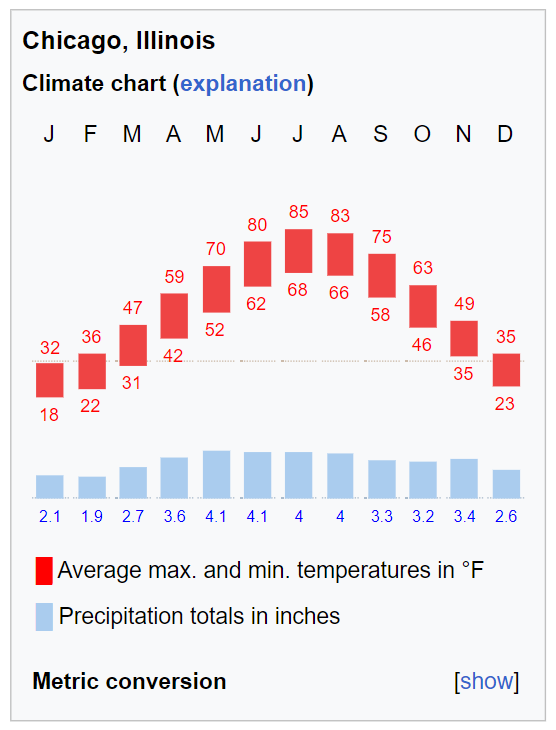

```{r setup, include=FALSE}
knitr::opts_chunk$set(echo = TRUE)
```

# Introduction

## Research Question

How does time of year affect the distance of Divvy trips taken by riders? Which community areas are most affected by seasonal differences, and in what ways?

## Hypothesis

Divvy riders will take longer rides in the warmer months as temperatures rise, ice clears from the streets, and people either see Divvy as a more viable option or decide to take more pleasure rides.

# Setup

## Library Packages

```{r libraries, message = FALSE}
library(tidyverse)
library(dplyr)
library(sf)
library(tmap)
library(stplanr)
library(geosphere)
library(ggplot2)
library(ggpubr)
```

## Get Data

For the monthly data, I chose the most recently January (representing winter), April (representing spring), July (representing summer), and October (representing fall) in the Divvy dataset. These months were chosen in accordance to temperature variations in Chicago. July is the hottest month, while January is the coldest, and April and October fall in between. The data is from the Divvy Trip History Dataset (https://divvy-tripdata.s3.amazonaws.com/index.html), as Divvy is one of Chicago's Transit Network Partners that it collects data from.



```{r get-data, message=FALSE, warning=FALSE}

# Divvy Data
jan <- read.csv("~/GISC 37104/Thurs_TransportDivvy/data/202301-divvy-tripdata.csv")
apr <- read.csv("~/GISC 37104/Thurs_TransportDivvy/data/202304-divvy-tripdata.csv")
jul <- read.csv("~/GISC 37104/Thurs_TransportDivvy/data/202207-divvy-tripdata.csv")
oct <- read.csv("~/GISC 37104/Thurs_TransportDivvy/data/202210-divvy-tripdata.csv")

#Community Areas
cas <- st_read("~/GISC 37104/Thurs_TransportDivvy/data/CommAreas.shp")
```

# Work with Data

## Refactor Data

This involved removing all rides with missing data for start or end station. These rides would not be helpful in conducting the analysis.

```{r refactor-data, message=FALSE, warning=FALSE}
# methods taken from "transportation_divvy_viz"

# replace blanks with NA values, rename shorter
jan <- jan %>% mutate_if(is.character, ~na_if(., ''))
apr <- apr %>% mutate_if(is.character, ~na_if(., ''))
jul <- jul %>% mutate_if(is.character, ~na_if(., ''))
oct <- oct %>% mutate_if(is.character, ~na_if(., ''))

# specify non-NA origins and destinations - dataset shrinks from 190301 to 148284 observations for january
jan_def <- jan %>% 
  drop_na(start_station_id) %>%
  drop_na(end_station_id)
apr_def <- apr %>% 
  drop_na(start_station_id) %>%
  drop_na(end_station_id)
jul_def <- jul %>% 
  drop_na(start_station_id) %>%
  drop_na(end_station_id)
oct_def <- oct %>% 
  drop_na(start_station_id) %>%
  drop_na(end_station_id)
```

## Calculate Distances

This step took quite a bit of searching and reading through documentation. I eventually settled on the distVincentySphere function in the geosphere package, which uses a datum to calculate the distance between two coordinates along the earth's surface. I struggled with getting them in the right df format, but eventually it worked out.

```{r calculate-distances, message = FALSE, warning=FALSE}
# Calculate distance with geosphere package and add it to the data

# January
o_coords_jan <- data.frame(lon = jan_def$start_lng, lat = jan_def$start_lat)
d_coords_jan <- data.frame(lon = jan_def$end_lng, lat = jan_def$end_lat)
jan_def$dists <- distVincentySphere(o_coords_jan, d_coords_jan)

# April
o_coords_apr <- data.frame(lon = apr_def$start_lng, lat = apr_def$start_lat)
d_coords_apr <- data.frame(lon = apr_def$end_lng, lat = apr_def$end_lat)
apr_def$dists <- distVincentySphere(o_coords_apr, d_coords_apr)

# July
o_coords_jul <- data.frame(lon = jul_def$start_lng, lat = jul_def$start_lat)
d_coords_jul <- data.frame(lon = jul_def$end_lng, lat = jul_def$end_lat)
jul_def$dists <- distVincentySphere(o_coords_jul, d_coords_jul)

# October
o_coords_oct <- data.frame(lon = oct_def$start_lng, lat = oct_def$start_lat)
d_coords_oct <- data.frame(lon = oct_def$end_lng, lat = oct_def$end_lat)
oct_def$dists <- distVincentySphere(o_coords_oct, d_coords_oct)
```

## Plot Histogram of Distance Distribution

```{r make-hists, message = FALSE, warning=FALSE}
# Include a red mean line to better show how mean distance traveled changes across months
# Include appropriate breaks, labels, and title

jan_dists <- ggplot(jan_def, aes(x = dists, y = after_stat(density))) +
  geom_histogram(breaks = c(0,500,1000,1500,2000,2500,3000,3500,4000,4500,5000)) +
  geom_vline(xintercept = mean(jan_def$dists), color = "red", linetype = "dashed", size = 1) +
  labs(x = "Distance Traveled (m)", y = "Frequency") + 
  ggtitle("Divvy Distance Distribution by Month") +
  theme(plot.title = element_text(hjust = 0.5, vjust = 1))
apr_dists <- ggplot(apr_def, aes(x = dists, y = after_stat(density))) +
  geom_histogram(breaks = c(0,500,1000,1500,2000,2500,3000,3500,4000,4500,5000)) +
  geom_vline(xintercept = mean(apr_def$dists), color = "red", linetype = "dashed", size = 1) +
  labs(x = "Distance Traveled (m)", y = "Frequency")
jul_dists <- ggplot(jul_def, aes(x = dists, y = after_stat(density))) +
  geom_histogram(breaks = c(0,500,1000,1500,2000,2500,3000,3500,4000,4500,5000)) +
  geom_vline(xintercept = mean(jul_def$dists), color = "red", linetype = "dashed", size = 1) +
  labs(x = "Distance Traveled (m)", y = "Frequency")
oct_dists <- ggplot(oct_def, aes(x = dists, y = after_stat(density))) +
  geom_histogram(breaks = c(0,500,1000,1500,2000,2500,3000,3500,4000,4500,5000)) +
  geom_vline(xintercept = mean(oct_def$dists), color = "red", linetype = "dashed", size = 1) +
  labs(x = "Distance Traveled (m)", y = "Frequency")
```

```{r plot-hist, message = TRUE, warning=FALSE}
ggarrange(jan_dists, apr_dists, jul_dists, oct_dists + rremove("x.text"), 
          labels = c("January", "April", "July", "October"),
          ncol = 1, nrow = 4)
```

## Spatialize and Plot Data

For this product, I wanted a choropleth map of Chicago community areas, according to the mean distance traveled from Divvy stations in that community area. To do that, I had to aggregate the monthly Divvy data within community areas by their origin points.

```{r spatialize, message = FALSE, warning = FALSE}
# Methods influenced by "transportation-divvy-viz".

# January
jan_o_spatial <- jan_def %>%
  select("ride_id", "start_station_id", "end_station_id","start_lat","start_lng","end_lat","end_lng","dists") %>%
  st_as_sf(coords=c("start_lng", "start_lat"), crs = 4326) # Select useful columns, spatialize origin lat/long as points
jan_o_spatial <- st_transform(jan_o_spatial,3435) # Directly spatializing into the CRS EPSG:3435 put the points in Southern Missouri, so I had to load them in 4326 first, then transform to 3435

jan_agg <- aggregate(x=jan_o_spatial, by=cas, FUN=mean) # Aggregate data to community area
jan_agg$dists <- jan_agg$dists/1000 # Convert from m to km

# April
apr_o_spatial <- apr_def %>%
  select("ride_id", "start_station_id", "end_station_id","start_lat","start_lng","end_lat","end_lng","dists") %>%
  st_as_sf(coords=c("start_lng", "start_lat"), crs = 4326) # x = longitude, y = latitude
apr_o_spatial <- st_transform(apr_o_spatial,3435)

apr_agg <- aggregate(x=apr_o_spatial, by=cas, FUN=mean)
apr_agg$dists <- apr_agg$dists/1000

# July
jul_o_spatial <- jul_def %>%
  select("ride_id", "start_station_id", "end_station_id","start_lat","start_lng","end_lat","end_lng","dists") %>%
  st_as_sf(coords=c("start_lng", "start_lat"), crs = 4326) # x = longitude, y = latitude
jul_o_spatial <- st_transform(jul_o_spatial,3435)

jul_agg <- aggregate(x=jul_o_spatial, by=cas, FUN=mean)
jul_agg$dists <- jul_agg$dists/1000

# October
oct_o_spatial <- oct_def %>%
  select("ride_id", "start_station_id", "end_station_id","start_lat","start_lng","end_lat","end_lng","dists") %>%
  st_as_sf(coords=c("start_lng", "start_lat"), crs = 4326) # x = longitude, y = latitude
oct_o_spatial <- st_transform(oct_o_spatial,3435)

oct_agg <- aggregate(x=oct_o_spatial, by=cas, FUN=mean)
oct_agg$dists <- oct_agg$dists/1000
```

## Make Maps

```{r get-spatial, message = FALSE, warning = FALSE}
# Create tmaps with appropriate breaks, titles, and labels

jan_dists_ca <- tm_shape(jan_agg) + 
  tm_fill("dists", breaks = c(0,1,1.5,2,2.5,3,3.5,4,5),title="Distance (km)", title.position = "top") +
  tm_layout(title = "Mean Divvy Ride Distances: 01/2023")
apr_dists_ca <- tm_shape(apr_agg) + 
  tm_fill("dists", breaks = c(0,1,1.5,2,2.5,3,3.5,4,5),title="Distance (km)", title.position = "top") +
  tm_layout(title = "Mean Divvy Ride Distances: 04/2023")
jul_dists_ca <- tm_shape(jul_agg) + 
  tm_fill("dists", breaks = c(0,1,1.5,2,2.5,3,3.5,4,5),title="Distance (km)", title.position = "top") +
  tm_layout(title = "Mean Divvy Ride Distances: 07/2022")
oct_dists_ca <- tm_shape(oct_agg) + 
  tm_fill("dists", breaks = c(0,1,1.5,2,2.5,3,3.5,4,5),title="Distance (km)", title.position = "top") +
  tm_layout(title = "Mean Divvy Ride Distances: 10/2022")
```

```{r plot-maps, message = TRUE, warning = FALSE}
# Arrange maps

tmap_arrange(jan_dists_ca, apr_dists_ca, jul_dists_ca, oct_dists_ca, nrow = 2, ncol = 2)
```

## Calculate Seasonal Difference

Since it was somewhat difficult to see the compare community-by-community seasonal ride distance differences even when the maps were arranged next to each other, I calculated the summer-winter difference and plotted it.

```{r calculate-diff, message = FALSE, warning = FALSE}
# Compute difference between high and low seasons

diff_agg <- jul_agg %>%
  select("ride_id")
diff_agg$season_diff <- (jul_agg$dists-jan_agg$dists)/jan_agg$dists
```

```{r plot-diff-maps, message = TRUE, warning = FALSE}
# Plot difference tmap

season_dists_ca <- tm_shape(diff_agg) + 
  tm_fill("season_diff") +
  tm_layout(title = "Difference in Mean Travel Distance: July-January")
season_dists_ca
```

# Conclusion

## Discussion

Through this exercise, I found that, in line with my hypothesis, mean Divvy ride distance increased (from 1.7 km in January to 2.2 km in July) in the warmer months. Although the difference (29%) is somewhat small, it is significant given than hundreds of thousands of Divvy rides were taken each month. While longer rides (>4km) were largely unheard of in January, they happened more often in April and October, and especially June. This may be due to better road and weather conditions in warmer months that make riding bikes appealing. Students on summer break may also take long bike rides in the summer, as well as people attending the summer festivals that are common in Chicago.

I also found that mean ride distance varied significantly across communities areas. Community areas on the North, Northwest, and West Sides (including the anomalous Montclare) had particularly long mean rides, which may signify residents' needs to commute relatively far in sparser neighborhoods, as compared to the loop and its semi-urban ring. It also might signify a propensity to bike long distances for recreation (i.e. to the Loop). The Loop itself had relatively low mean ride distances year-round, which could signify the nearness of school, work, retail, or amenities due to its  density. Hyde Park (which I feel qualified to comment on) had relatively low ride distances as well, perhaps due to the insularity of the community area. Lastly, the South Side overall, and especially the Far South Side, had quite low mean ride distances. This may be due to a lack of long-distance riders: with relatively unrpotected and disconnected bike infrastructure (https://www.chicago.gov/content/dam/city/depts/cdot/bike/2023/2023%20Chicago%20Bike%20Map_web.pdf), riders may be discouraged from doing much other than short-distance trips.

I also learned about which communities experienced greatest seasonal change in Divvy trip distance. Increases were consistently modest in the center of the city, whereas the inland outer rings were a mixed bag, perhaps due to relatively low ridership in those areas. However, there was a stark increase in ridership in community areas on both the north and south coasts. This seems like it might directly reflect Lakefront Trail, the popular bike route that extends far north and south, even beyond the city itself. Residents of coastal community areas would have greater access and motivation to take the path in the summer. This shows the power of strong bike infrastructure.

## Limitations

These patterns may be affected by overall Divvy ridership trends, rather than just seasonal ones. Ideally, I would have collected data over multiple of each month so I could get a larger sample size and control for other effects, but that was more than I wanted to do, and could have still been subject to significant variance. However, this variance would probably across number of rides as the app waxed and waned in popularity, rather than distance.

I had hoped to use the od2line package to plot the mean directions (origin coordinate to destination coordinate) of rides from each community area, but it said my version of R (the newest one) was incompatible with it. I would love to try to do that in the future, though, if I hear any suggestions!